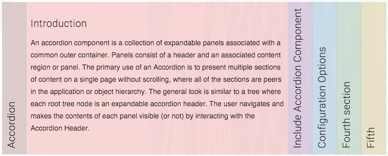
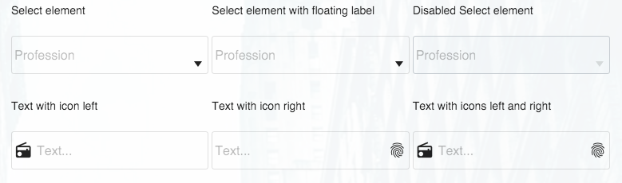
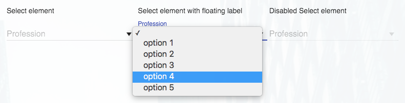

# MDL Webpack
A [Google Material Design Lite](http://www.getmdl.io/index.html) project built with NPM and Webpack.


Material Design is a design language developed by Google. Expanding upon the "card" motifs 
that debuted in Google Now, Material Design makes more liberal use of grid-based layouts, responsive animations and 
transitions, padding, and depth effects such as lighting and shadows.

Material Design Lite lets you add a Material Design look and feel to your websites. It doesn’t rely on any JavaScript 
frameworks and aims to optimize for cross-device use,  and offer an experience that is immediately accessible


```
npm install
npm run dev
http://localhost:8080/webpack-dev-server/
```


## What is included

### Custom components

#### Accordion Component


An accordion component is a collection of expandable panels associated with a common outer container. Panels consist of 
a header and an associated content region or panel. The primary use of an Accordion is to present multiple sections of 
content on a single page without scrolling, where all of the sections are peers in the application or object hierarchy. 
The general look is similar to a tree where each root tree node is an expandable accordion header. The user navigates 
and makes the contents of each panel visible (or not) by interacting with the Accordion Header.

Credits: The Accordion component is based on this [CodePen](http://codepen.io/aann/pen/dPqBML)


#### Bordered Input Fields Theme Component


Demonstrates how you can create your own theme of MDL text fields.

Credits: The Bordered Fields Theme component is based on this [CodePen](http://codepen.io/prajwal078/pen/LVJZXz)

#### Select Element Component


The HTML ```<select>``` element represents a control that presents a menu of options. MDL does not provide it's own 
component for the ```<select>``` element.

Credits: The Select component is based on the following sources:
* [Material Design Lite selectfield component](https://github.com/mebibou/mdl-selectfield) 
* [mdl-selectfield](https://github.com/MEYVN-digital/mdl-selectfield)
* [Simple Material Design Login, with select field](http://codepen.io/michaelschofield/pen/qEzWaM)
* [Material Design &lt;select&gt; element, css only](http://codepen.io/pudgereyem/pen/PqBxQx)

### Polyfills

#### Details Element Polyfill


The ```<details>``` element specifies additional details that the user can view or hide on demand. The ```<summary>``` 
element defines a visible heading for the ```<details>``` element. The heading can be clicked to view/hide the details.

The ```<details>``` element currently has very limited cross-browser support. To ensure support across all modern browsers, 
please consider using a polyfill or creating your own. I wrote my own polyfill using the following sources:

* https://github.com/jordanaustin/Details-Expander
* https://github.com/chemerisuk/better-details-polyfill
* http://codepen.io/stevef/pen/jiCBE
* http://blog.mxstbr.com/2015/06/html-details/
* http://html5doctor.com/the-details-and-summary-elements/
* http://zogovic.com/post/21784525226/simple-html5-details-polyfill
* http://www.sitepoint.com/fixing-the-details-element/
* https://www.smashingmagazine.com/2014/11/complete-polyfill-html5-details-element/
