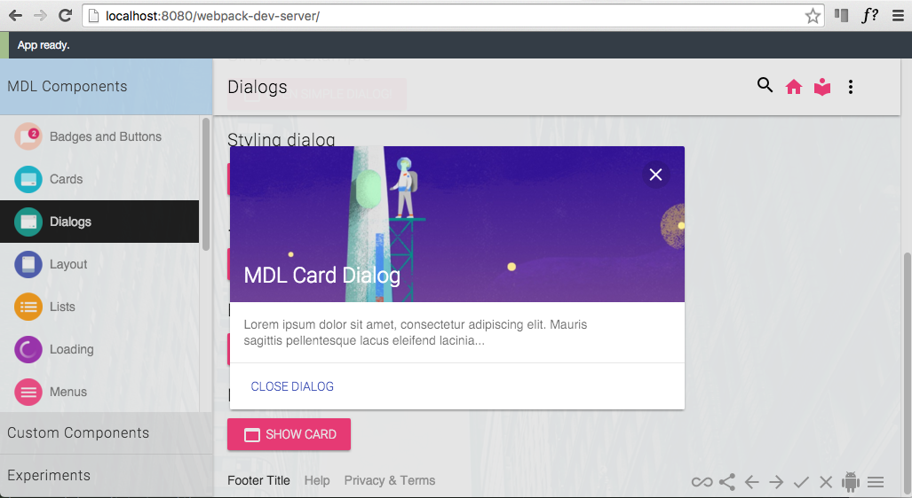

# MDL Webpack
A [Google Material Design Lite](http://www.getmdl.io/index.html) project built with Webpack.



Material Design (codenamed Quantum Paper) is a design language developed by Google. Expanding upon the "card" motifs 
that debuted in Google Now, Material Design makes more liberal use of grid-based layouts, responsive animations and 
transitions, padding, and depth effects such as lighting and shadows.

Material Design Lite lets you add a Material Design look and feel to your websites. It doesn’t rely on any JavaScript 
frameworks and aims to optimize for cross-device use,  and offer an experience that is immediately accessible


```
npm install
npm run dev
http://localhost:8080/webpack-dev-server/
```
